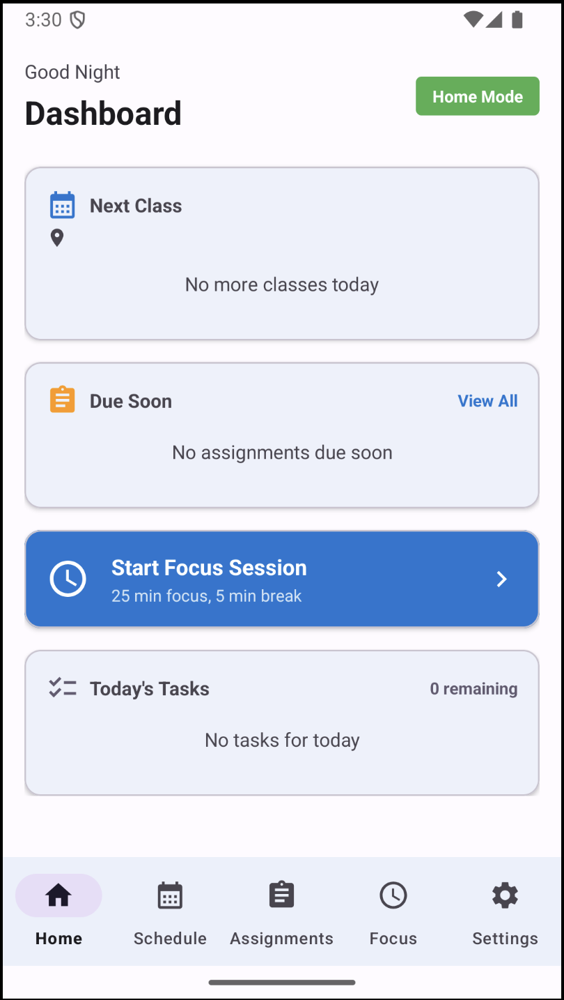
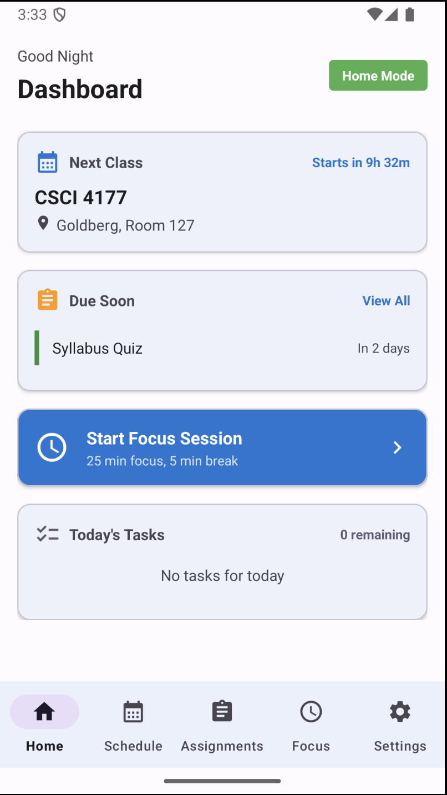
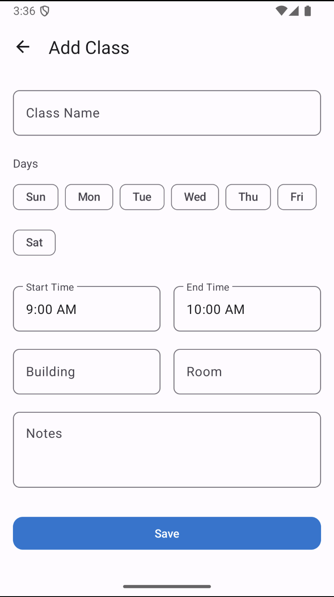
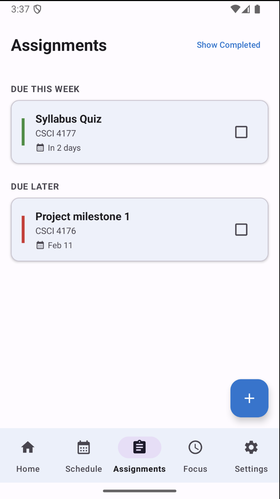
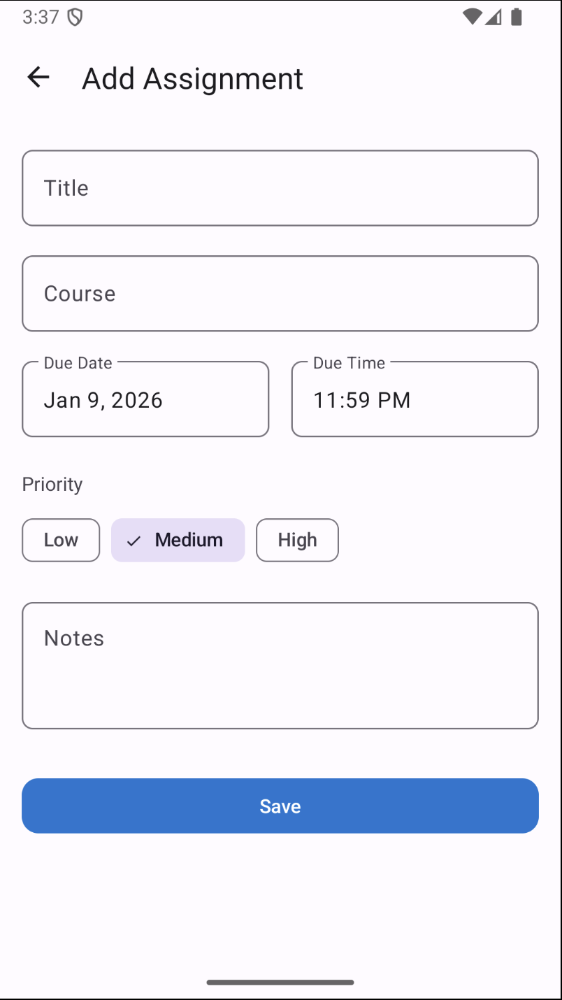
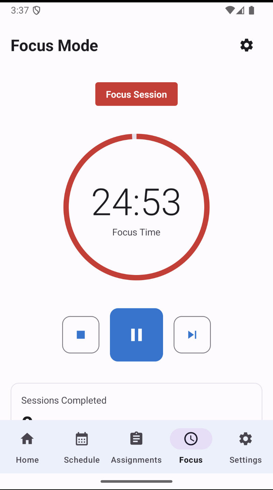
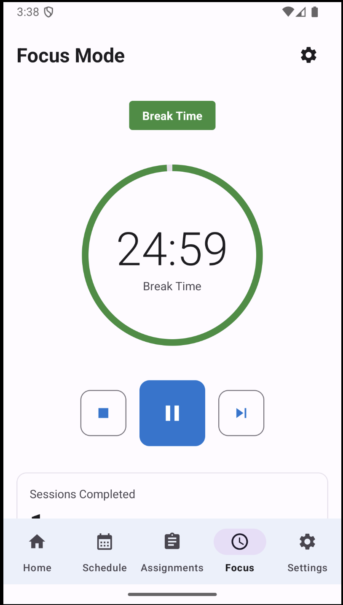
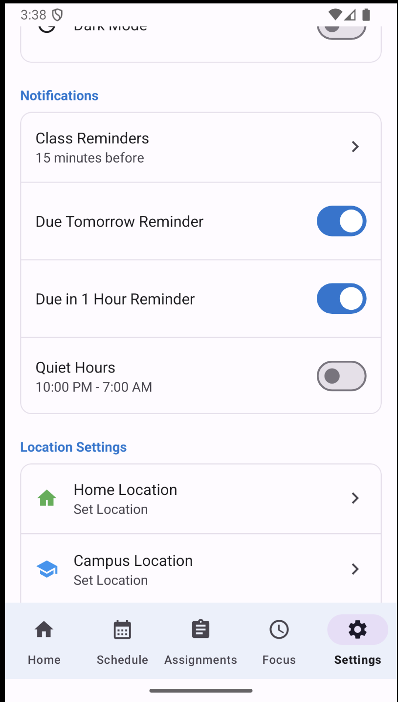
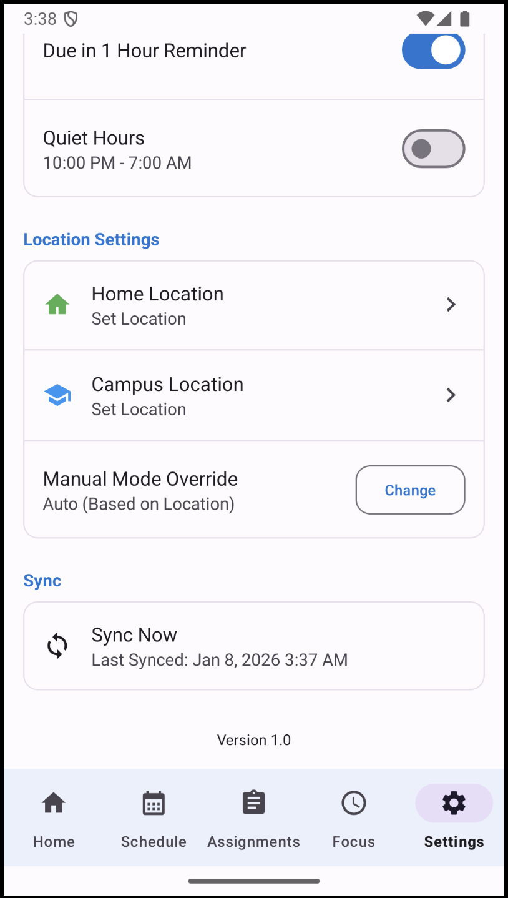

# StudentHub

StudentHub is an Android app I built to help students manage their daily academic life — classes, assignments, and focus time — with smart reminders and offline support.

The app adapts based on location and schedule, so students get the right information at the right time without being overwhelmed.

---

## Screenshots

### Home Dashboard

  
  

### Schedule

  
  

### Assignments

  
  

### Focus Mode

  
  

### Settings

  
  

---

## ✨ Features

### Authentication
- Email/password sign up and login
- User-specific data (each user only sees their own content)

### Dashboard
- Shows today’s classes and upcoming assignments
- Automatically adapts based on context (home vs campus)
- Works offline with automatic sync when online

### Schedule Management
- Add classes with days, time, and location
- Today and weekly views
- Countdown to next class
- Class reminders before start time

### Assignment Tracking
- Add assignments with due dates and priority
- Automatically grouped (Today, This Week, Later)
- Mark assignments complete
- Due date notifications

### Focus Mode (Pomodoro)
- Customizable focus/break timer
- Runs in the background
- Tracks completed focus sessions
- Completion notifications

### Smart Notifications
- Class reminders
- Assignment deadline alerts
- Quiet hours support
- Prevents notification spam

### Offline Support & Sync
- App works without internet
- Data stored locally using Room
- Syncs with Firebase Firestore when online

---

##  Tech Stack
- **Language:** Java
- **UI:** Android Views + XML (Material Design 3)
- **Architecture:** MVVM + Repository pattern
- **Local Storage:** Room (SQLite)
- **Authentication:** Firebase Auth
- **Database:** Firebase Firestore
- **Location:** Geofencing (Google Play Services)
- **Background Tasks:** Foreground Service, WorkManager
